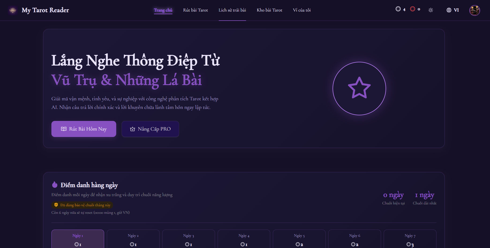
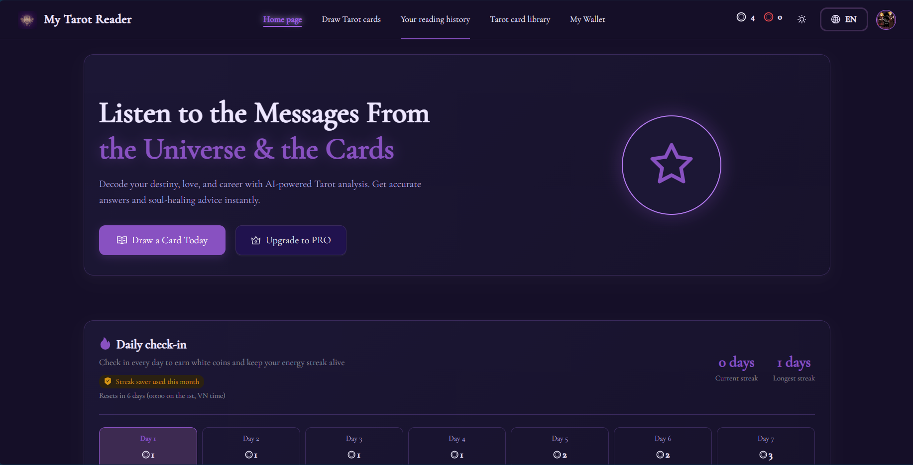
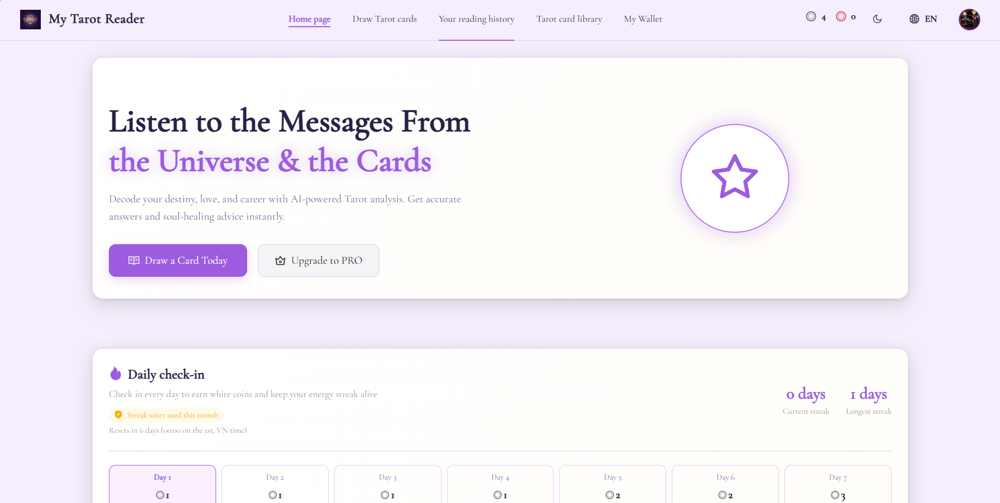
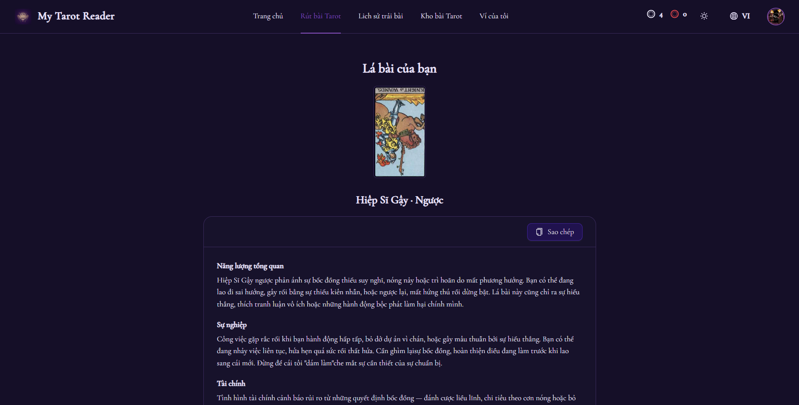
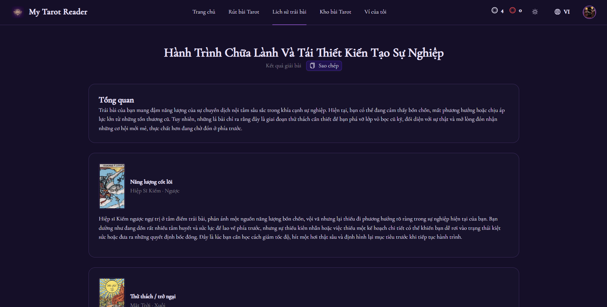
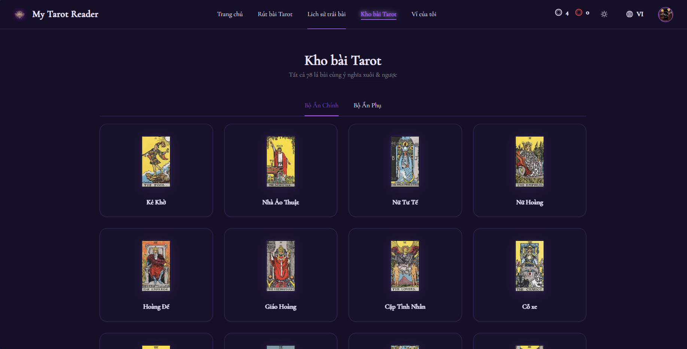

# My Tarot Reader

> An AI-assisted tarot reading web app. Draw a daily card, explore the full 78-card Rider–Waite library, build check-in streaks, and get AI-generated readings — with a bilingual (English / Vietnamese) UI.

> **Status:** The app is under active development — new features are being added regularly, and the screenshots below reflect the current state.

## Live Demo

- **Live demo:** https://my-tarot-reader.vercel.app/
- The API runs on Render's free tier and sleeps when idle — the first request may take 10–30 s to cold-start.













## Key Features

- **Daily tarot card draw** — guest users with a Redis cooldown + device fingerprint, or signed-in users with full history
- **Complete 78-card Rider–Waite library**, reversed cards included
- **AI tarot readings** powered by Google Gemini
- **Daily check-in** with a 7-day streak cycle and white/red coin rewards
- **Wallet & coin economy** with per-user balances
- **Google OAuth login** — HttpOnly cookies, device-bound refresh tokens with rotation
- **Reading history** — browse past readings and delete them
- **Card library** with upright/reversed meanings and detail modals
- **Bilingual UI** (English / Vietnamese)
- **Role-based themes** with dark / light modes

## Tech Stack

- **Backend:** ASP.NET Core 8 Web API — Clean Architecture, EF Core 8 + PostgreSQL (Npgsql), Redis, JWT (HttpOnly cookies), Google OAuth, MailKit (email), Google Gemini
- **Frontend:** React 19 + Vite 8 + TypeScript 6, Ant Design v6, TanStack Query v5, react-router v7, Zustand, react-i18next, axios, FingerprintJS, oxlint
- **Database:** PostgreSQL + Redis
- **CI/CD:** GitHub Actions (build + deploy), Render (API), Vercel (SPA), Dockerfile
- **Testing:** xUnit + Moq + EF Core InMemory + FluentAssertions (backend)

## Project Structure

- `Backend/` → ASP.NET Core 8 Web API — see [Backend/README.md](./Backend/README.md)
- `Frontend/` → React SPA — see [Frontend/README.md](./Frontend/README.md)

## Run the Whole System Locally

**Prerequisites**

- [.NET SDK 8](https://dotnet.microsoft.com/download/dotnet/8.0)
- [PostgreSQL](https://www.postgresql.org/download/)
- [Redis](https://redis.io/download/) (local or a cloud instance like Upstash)
- [Node.js 24](https://nodejs.org/) + npm

**1. Clone the repository**

```bash
git clone https://github.com/Aquarius2301/My-Tarot-Reader.git
cd My-Tarot-Reader
```

**2. Configure and run the backend**

Set your local values in `Backend/src/Api/appsettings.json` (PostgreSQL connection, Redis, Google Client ID, Gemini API key — see the [Backend README](./Backend/README.md) for the full table). Then:

```bash
cd Backend
./scripts/update-database.sh     # Windows: update-database.cmd  (apply EF Core migrations)
./scripts/run-local.sh           # Windows: run-local.cmd
```

The API runs at http://localhost:5271 (Swagger UI at http://localhost:5271/swagger in Development).

**3. Configure and run the frontend**

Set `VITE_API_URL` in `Frontend/.env` (defaults to `http://localhost:5271`). Then:

```bash
cd Frontend
npm install
npm run dev
```

The SPA runs at http://localhost:5173.

## Contributing

1. Read the backend/frontend conventions in the matching repository:
   - `.agent/skills/backend-dotnet-architecture/SKILL.md`
   - `.agent/skills/backend-dotnet-testing/SKILL.md`
   - `.agent/skills/frontend-react-architecture/SKILL.md`

2. Keep changes minimal and consistent with existing barrel/folder conventions.
3. Backend operations always go through `Backend/scripts/*.{sh,cmd}` — never raw `dotnet run` / `dotnet ef`.
4. Never commit real secrets — `appsettings*.json` keep placeholders / local-only values.
5. Run `npm run lint` and `npm run build` for frontend changes before finishing.
